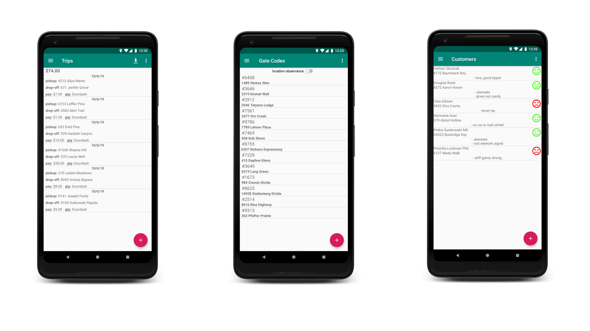

#  Courier Locker

Courier Locker is a free and open source gig record book for Android.

## Features

Features include:
* Store and keep track of Trips, Apartment Codes, and Customers
* Export Trips to a spreadsheet
* See total earnings across multiple gigs
* Create personal maps of places that are difficult to navigate, like apartment complexes

## Download
Get the app from the [Google Play Store](https://play.google.com/store/apps/details?id=name.lmj0011.courierlocker.prod).

## Documentation

app documentation can be found at:

https://github.com/lmj0011/courier-locker/tree/master/docs

## Issues, Feature Requests and Contributing

Please make sure to read the full guidelines. Your issue may be closed without warning if you do not.

Bugs

* Include version information
* If not latest, try updating, it may have already been solved
* Include steps to reproduce (if not obvious from description)
* Include screenshot (if needed)
* If it could be device-dependent, try reproducing on another device (if possible)
* For large logs use http://pastebin.com/ (or similar)
* Don't group unrelated requests into one issue

Feature Requests

* Write a detailed issue, explaining what it should do or how. Avoid writing just "like X app does"
* Include screenshot (if needed)

## License

    Copyright 2019-2022 Landan Jackson

    Licensed under the Apache License, Version 2.0 (the "License");
    you may not use this file except in compliance with the License.
    You may obtain a copy of the License at

    http://www.apache.org/licenses/LICENSE-2.0

    Unless required by applicable law or agreed to in writing, software
    distributed under the License is distributed on an "AS IS" BASIS,
    WITHOUT WARRANTIES OR CONDITIONS OF ANY KIND, either express or implied.
    See the License for the specific language governing permissions and
    limitations under the License.
