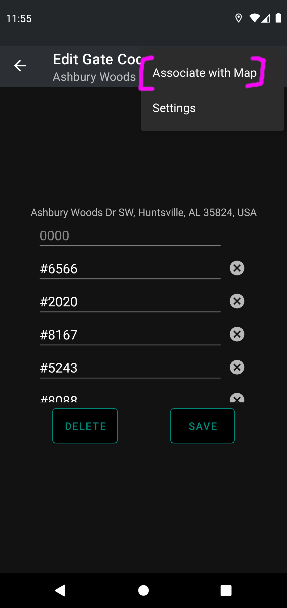
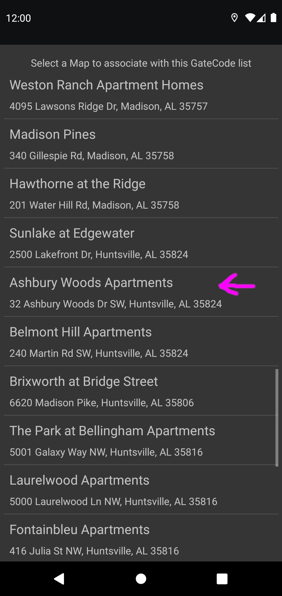
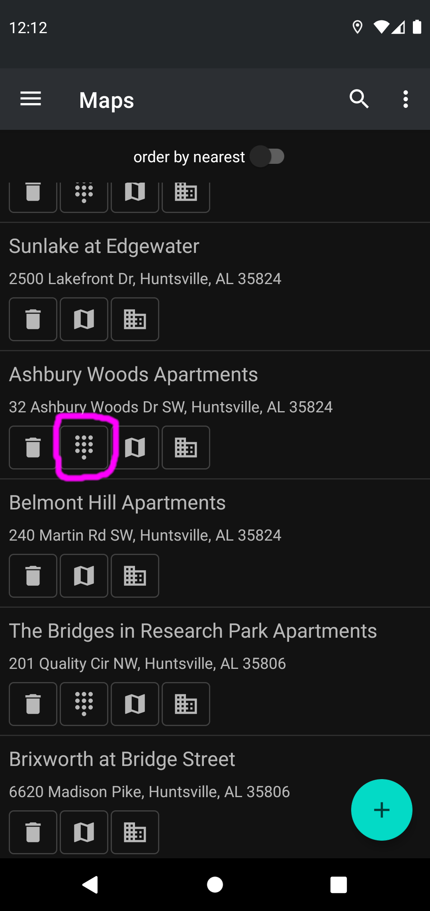
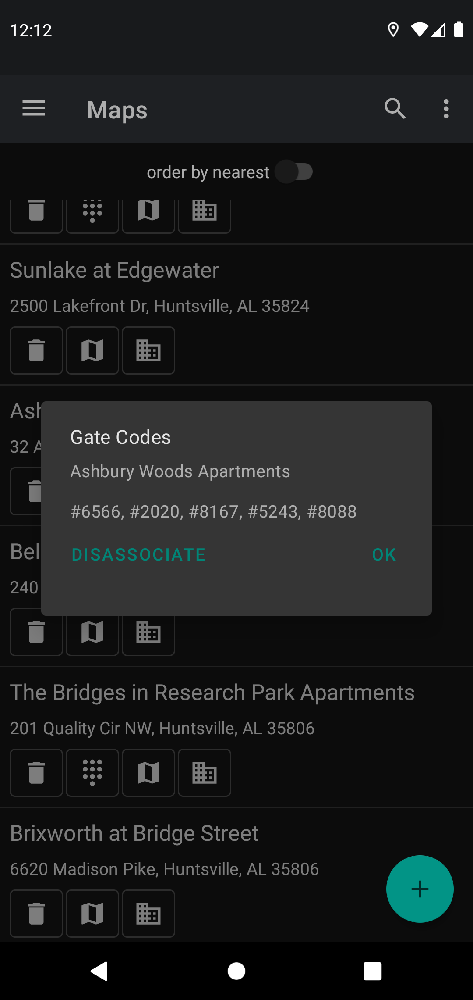

Gatecode and Map Association
============

Gatecodes are quick to gather and store, while Map creation can take some time to accomplish. 
At some point you may find that you have Gatecodes and a Map that respresent the same location.
Associating the two allows you to view gatecodes in your list of Maps

First go to the Gatecode that you want to associate with a Map, then select "Associate with Map" from the overflow menu

Select a Map to associate the gatecodes with

The end result is being able to view the gatecodes now from the Maps screen

&nbsp;
&nbsp;
&nbsp; 
