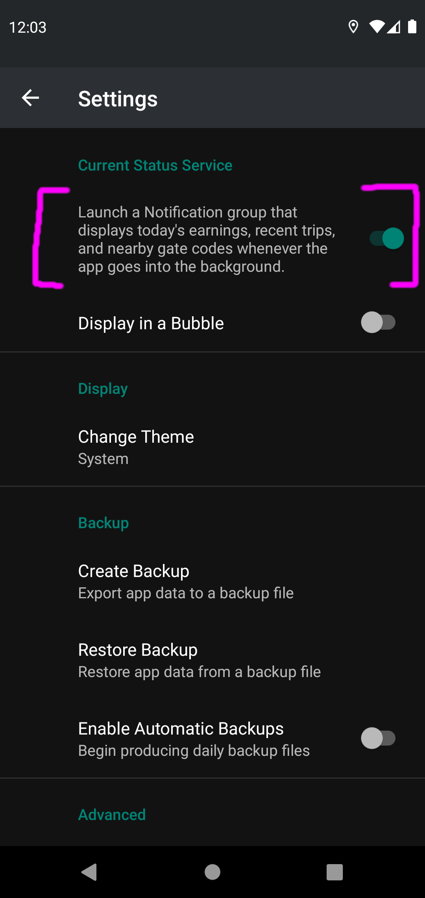
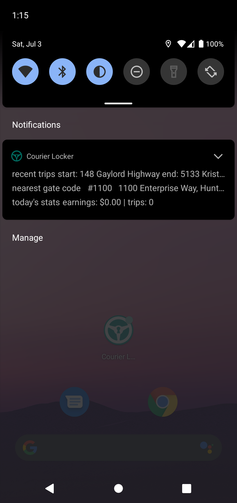
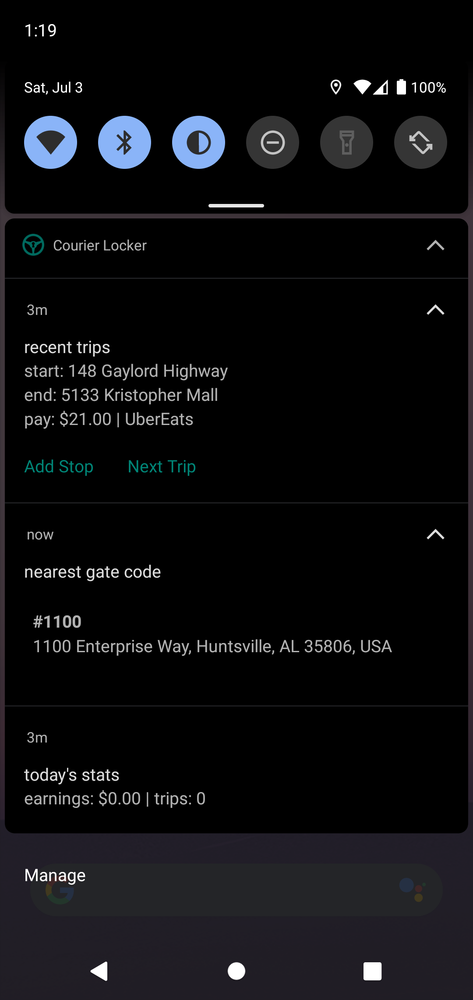
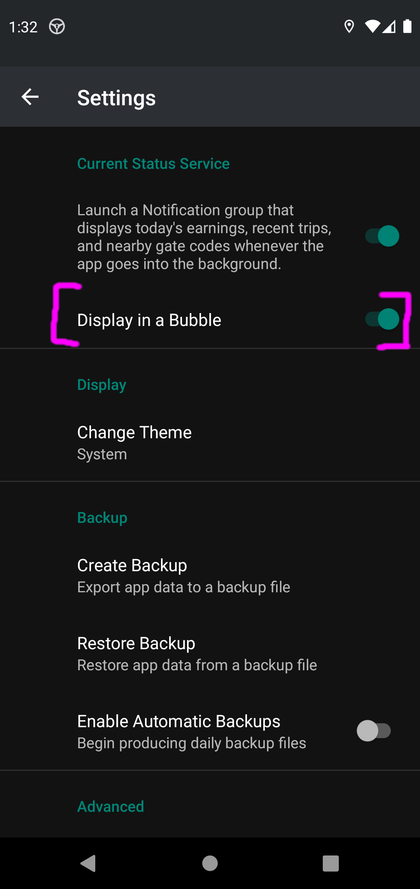
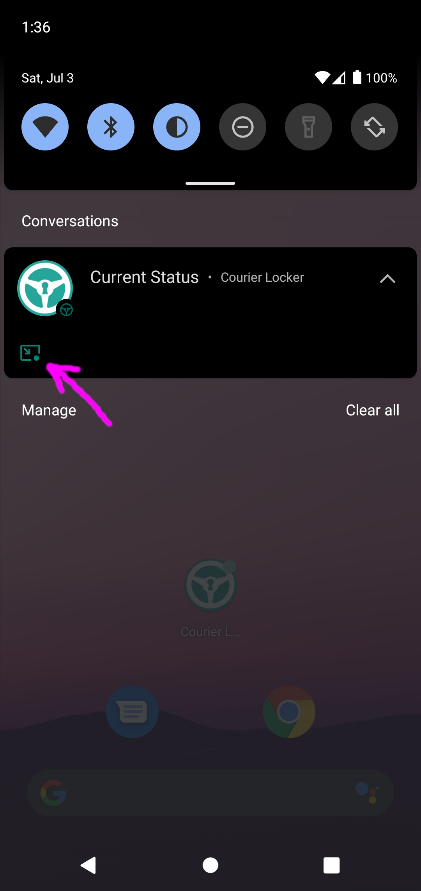
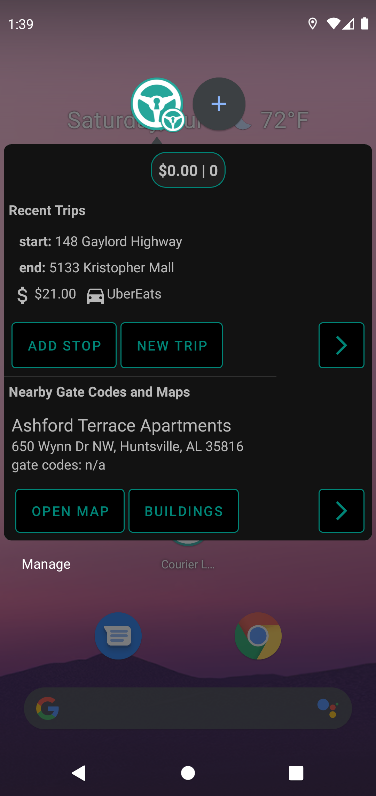

Using The Current Status Service
============

The Current Status Service is a feature that provides the user with quick access to the app's essential features by way of
a Notification Group or Conversation Bubble. The main benefit this provides is requiring less opening and closing of the app.

This feature can be enabled or disabled in Settings

When enabled in Settings, the Current Status Service starts when the app goes into the background

### Notification Group

By default, the Current Status Service is displayed in a Notification group. 

&nbsp;
&nbsp;
&nbsp;      

You can cycle between your 3 most recent trips and add stops if needed.

The nearest gatecode based on your current location is shown

The total amount of trips and the total trip earnings for today is shown.

### Conversation Bubble

Displaying the Current Status Service within a conversation Bubble is only available on Android 11 or higher.

You must first enable it in Settings

In the notification shade, a notification will show up with an icon in the bottom corner, tap it to trigger the Bubble

&nbsp;
&nbsp;
&nbsp; 

The Bubbled Current Status Service provides the same functionality as the Notification Group and more...

You can create new Trips on the fly

The nearest gatecode and maps based on your current location are shown

You can open directions to a Map building
